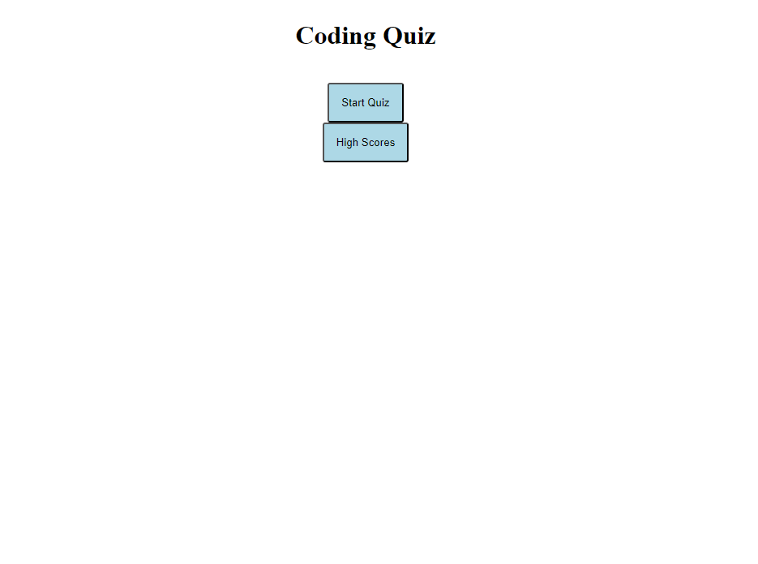
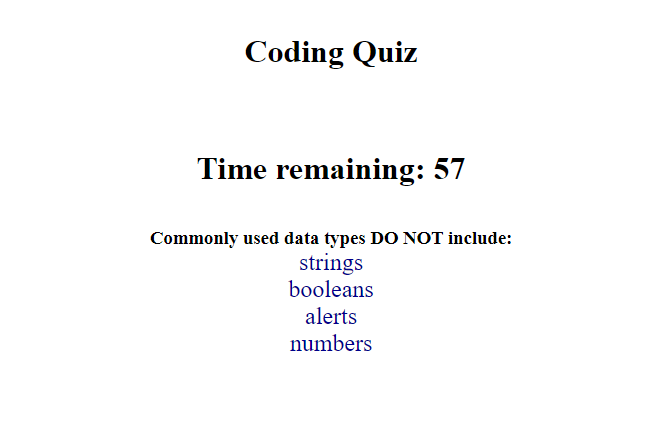
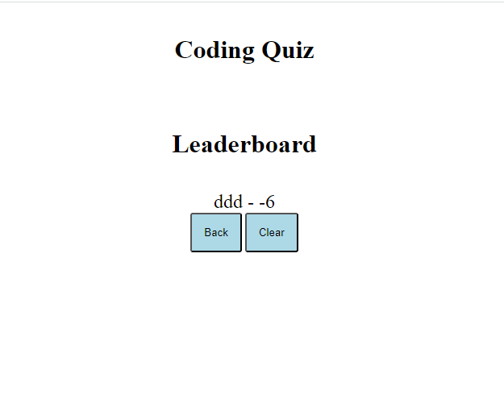

# Quiz-API

#### By Patrick Lowe
#### A webpage hosting a timed multiple choice quiz
#
## Technologies Used

### JavaScript
### HTML
### CSS
### Visual Studio Code
### GitBash
### Web-API's
#
## Description

#### I was asked to make a multiple choice timed quiz with a highscoreboard that saves the users score and initials to the local storage 
#
## Getting Setup

#### You are not given any starter code other than a questions, options, and answers array. You need to code following the parameters below:

#### AS A coding boot camp student
#### I WANT to take a timed quiz on JavaScript fundamentals that stores high scores
#### SO THAT I can gauge my progress compared to my peers
## Acceptance Criteria
#### GIVEN I am taking a code quiz
#### WHEN I click the start button
#### THEN a timer starts and I am presented with a question
#### WHEN I answer a question
#### THEN I am presented with another question
#### WHEN I answer a question incorrectly
#### THEN time is subtracted from the clock
#### WHEN all questions are answered or the timer reaches 0
#### THEN the game is over
#### WHEN the game is over
#### THEN I can save my initials and my score
#

## Screenshot of Website 

## References 

#### https://www.w3schools.com/js/js_timing.asp
#### https://developer.mozilla.org/en-US/docs/Web/API/EventTarget/addEventListener
#### https://developer.mozilla.org/en-US/docs/Learn/HTML/Howto/Use_data_attributes
#### https://developer.mozilla.org/en-US/docs/Web/API/Window/localStorage
####

## Link to the deployed website 

### https://patrickwlowe.github.io/Quiz-API/